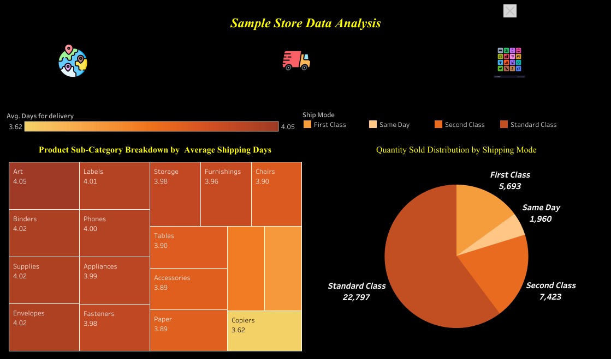
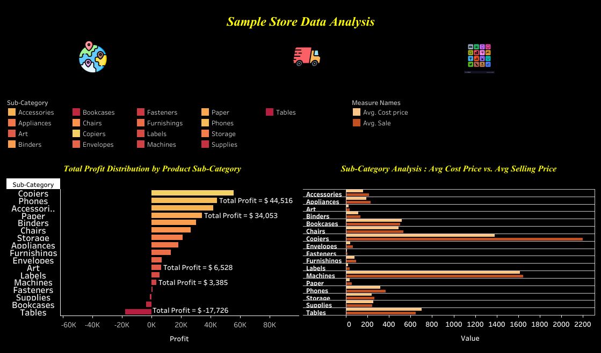

# Sample Store Sales Analysis: Tableau Dashboard Project

## INTRODUCTION

Welcome to the "Sample Store Sales Analysis" project. This Tableau dashboard provides an in-depth analysis of sales, profit, and shipping services for the Town Sample Store. By exploring key metrics and answering crucial business questions, this project highlights trends and insights to support data-driven decision-making.

**_DISCLAIMER_** : _All the datasets and reports do not represent any Company, Institution or Country , but just a dummy dataset to demonstrate capabilities of Tableau_.
 
## Problem Statement
1. Identify the state with the highest profitability and its profit score.
2. Identify the zone with the highest sales, indicating the most engaged store area.
3. Determine the quantity of products deliver on the same day.
4. Determine the product sub-category with the highest average delivery days.
5. Identify the most profitable product sub-category.
6. Determine if there are any product sub-categories operating at a loss and identify them.

## Skills/Concept Demostrated
- Data comprehension,
- Transformation,
- Math and statistical analysis,
- Buttons,
- Page Navigation,
- Analytical and Visualization skill

## Visualization
The Report comprises three pages :
1. Region Metrics
2. Shipping Insights
3. Product performance

You can interact with the report [here]https://public.tableau.com/views/InteractivedashboardofSamplestoresalesdata/InteractiveResgionandStatewiseSalesAnalysisDashboard?:language=en-US&:sid=&:redirect=auth&:display_count=n&:origin=viz_share_link

### Region Metrics

 _Features_ : 1. A button image ("Globe button ") is used for navigation, directing you to the "Regional Metrics" page for easy access to sales and profit analysis across regions.
2. A customized Color Palette highlights state profitability, ranging from loss to profit with fixed colors. This visual aid makes it easy to distinguish states with the least and highest profits .

_Analysis_ : 1. The highest profit scored state is California and its profit is $76,381.6
2. The highest sales in the West Zone can be attributed to greater customer engagement at the stores in that region.
3. Despite the Central Zone having the third-highest sales and the South Zone the lowest, the Central Zone recorded the lowest profit, while the South Zone's profit exceeded that of the Central Zone.

### Shipping Insights

 

_Features_ : 1. Used Pie chart for quantity distribution by Shipmode.
2. Treemap is used to analyse the avg shiping days of each product sub-category.

_*Analysis*_
1. Only 1,960 products delivered on the same day.
2. The copiers has the lowest avg delivery days of 3.62 days where as the sub categrory Art takes highest avg days to get delivered which is 4.05 days.

### Product Performance

_Feature_ 1. Bar chart is used to distribute the profit by product subcategories and arranged it in descending order of profit made.
2. A comparison of cost and sale price of each product category is also shown in terms of bar graph.

_Analysis_ 
1. It is clearly seen that the most profitable product category is Copiers.
2. Supplies, Bookcases and Tables are the three product subcategory which are in loses. Tables scores the highest loss for the sample superstore.

## Conclusion
1.The Copier , Phone and Accessory are the three highest profit generating product subcategory.
2. A large no. of quantity is delivered through standard mode where as the least no. of quantity is being delivered on the same day.
3. Texas scores the highest in loss .

## Recommendation

To improve profitability in the Central Zone, focus on optimizing operational efficiency and revising pricing strategies. Leveraging the success of the Copier subcategory, consider expanding its presence or promoting similar high-margin products in underperforming zones to drive overall profitability.

