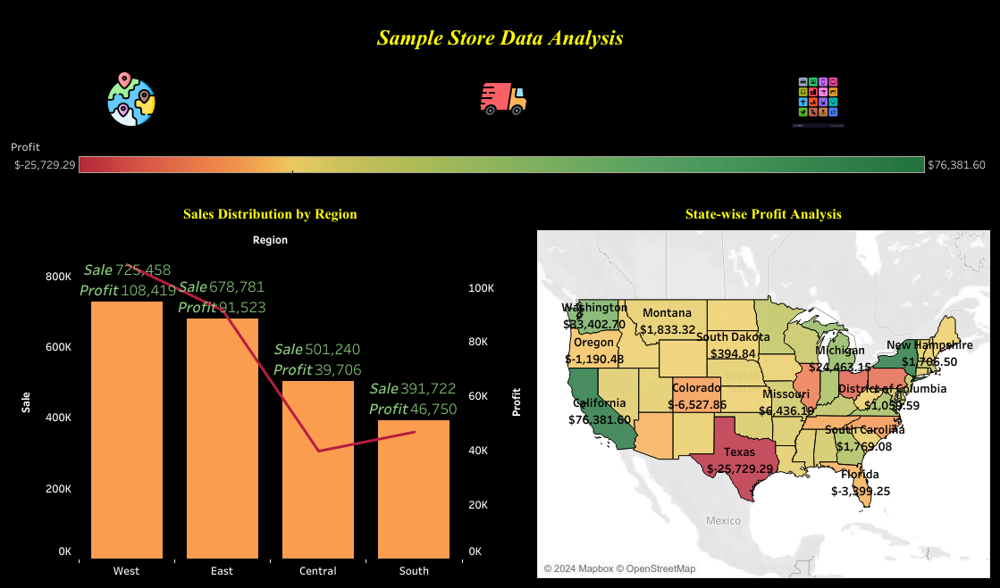

# Sample Store Sales Analysis: Tableau Dashboard Project

## INTRODUCTION

Welcome to the "Sample Store Sales Analysis" project. This Tableau dashboard provides an in-depth analysis of sales, profit, and shipping services for the Town Sample Store. By exploring key metrics and answering crucial business questions, this project highlights trends and insights to support data-driven decision-making.

**_DISCLAIMER_** : _All the datasets and reports do not represent any Company, Institution or Country , but just a dummy dataset to demonstrate capabilities of Tableau_.
 
## Problem Statement
1. Identify the state with the highest profitability and its profit score.
2. Identify the zone with the highest sales, indicating the most engaged store area.
3. Determine the quantity of products deliver on the same day.
4. Determine the product sub-category with the highest average delivery days.
5. Identify the most profitable product sub-category.
6. Determine if there are any product sub-categories operating at a loss and identify them.

## Skills/Concept Demostrated
- Data comprehension,
- Transformation,
- Math and statistical analysis,
- Buttons,
- Page Navigation,
- Analytical and Visualization skill

## Visualization
The Report comprises three pages :
1. Region Metrics
2. Shipping Insights
3. Product performance

You can interact with the report [here] https://public.tableau.com/views/InteractivedashboardofSamplestoresalesdata/InteractiveResgionandStatewiseSalesAnalysisDashboard?:language=en-US&:sid=&:redirect=auth&:display_count=n&:origin=viz_share_link

 _Features_ : 1. A button image ("Globe button ") is used for navigation, directing you to the "Regional Metrics" page for easy access to sales and profit analysis across regions.
2. A customized Color Palette highlights state profitability, ranging from loss to profit with fixed colors. This visual aid makes it easy to distinguish states with the least and highest profits .

